# Discord-Based C2 Simulation

## 1. Project Overview

This project was developed to study how legitimate software platforms can be abused as Command-and-Control (C2) infrastructure.

In this project, we simulated how attackers can leverage Discord — a widely trusted communication platform — as a C2 channel to remotely interact with a compromised system.
All experiments were performed strictly in a controlled lab environment using systems and networks owned by us.

The goal of this project was learning and risk awareness, not real-world exploitation.

---

## 2. Purpose of the Project

- Understand how legitimate services can be misused for malicious purposes
- Study modern attacker tradecraft, especially used by APT groups
- Gain hands-on exposure to malware C2 concepts in a safe environment

---

## 3. High-Level Concept

At a high level, the project works as follows:

- A Discord server was created for communication
- A Discord bot was configured to act as a control interface
- A Python-based binary was used to establish communication with the bot
- The binary was packaged together with decoy content to reduce suspicion
- Once executed, the system connects outward to Discord
- Commands and responses are exchanged through the Discord bot

⚠️ No source code, binaries, or weaponized artifacts are shared in this repository.

---

## 4. Why Discord as a C2 Channel?

This project demonstrates a key concept in modern malware design:

> Attackers no longer need custom infrastructure to stay hidden.

Discord offers:

- Encrypted HTTPS communication
- Trusted domains that are often allowlisted
- High availability and global reach
- API-based messaging that blends into normal traffic

Because the connection is outbound and encrypted, many security controls treat it as legitimate activity.

---

## 5. Simulated Post-Connection Capabilities

Once a connection is established (in our lab setup), the following capability categories were explored for learning purposes:

- Screen capture and screen recording
- Microphone and webcam access
- Keystroke logging
- File upload and download
- Basic system interaction (restart, persistence testing)
- Remote command execution

These capabilities were studied only to understand attacker behavior, not to deploy real-world threats.

---

## 6. Defensive & Security Takeaways

Through this project, we learned that:

- Trusted applications can become attack surfaces
- Signature-based detection is often insufficient
- Network traffic alone does not indicate intent
- Context and behavior matter more than file type
- SaaS abuse is a growing trend in real-world attacks

This aligns closely with techniques used by Advanced Persistent Threat (APT) groups.

---

## 7. Project Snippets

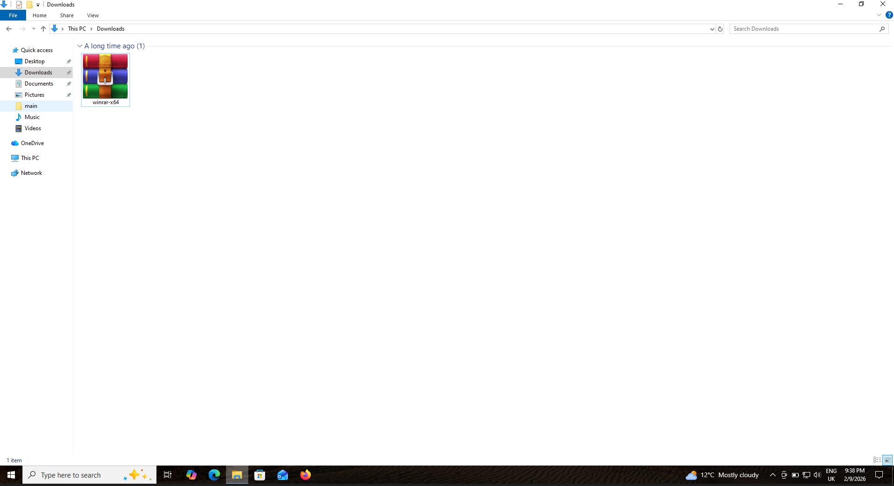

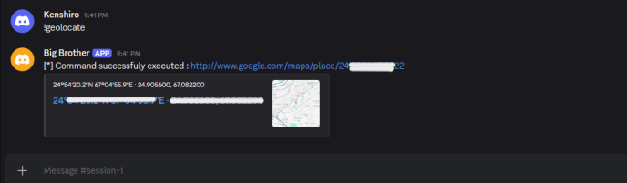
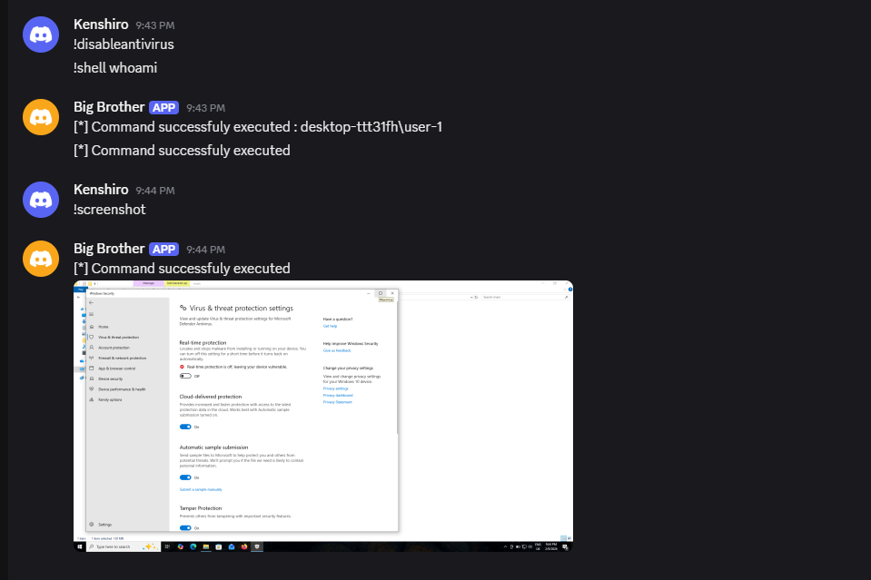
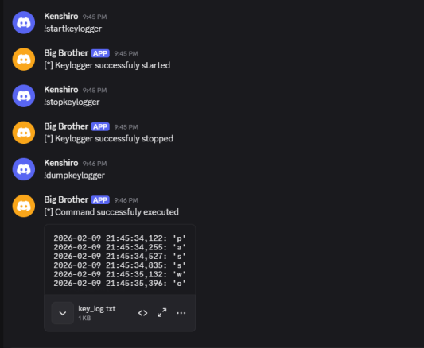
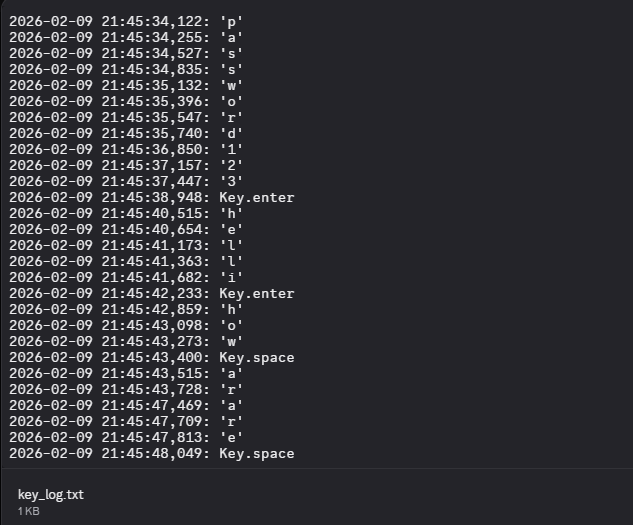
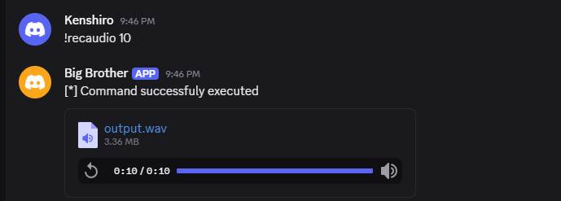
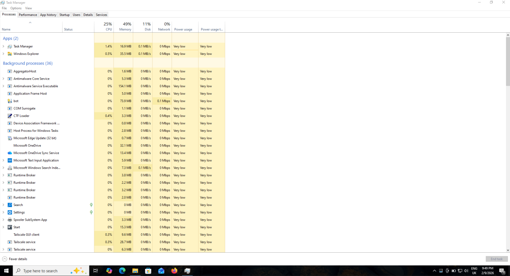
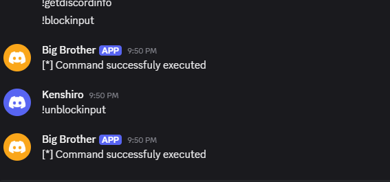

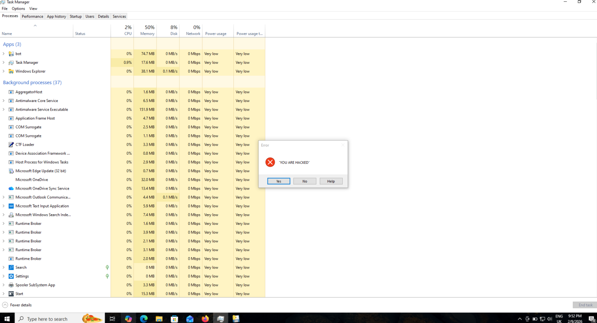
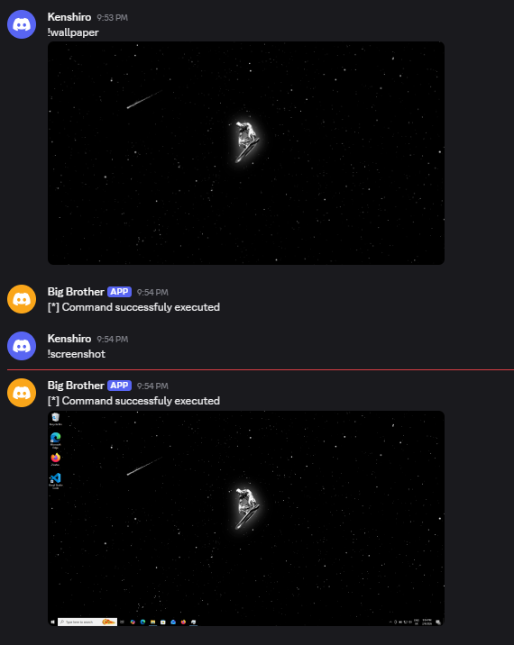
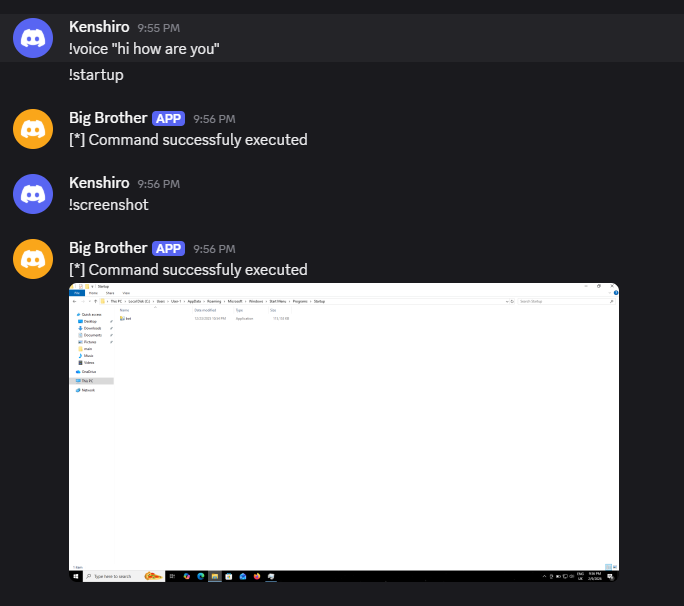

---

## Acknowledgements

Project developed in collaboration with [Muhammad Rayyan](https://github.com/muhammadrayyann)

---

## ⚠️ Ethical Disclaimer

This project was created strictly for academic purposes:

- All systems were owned by the researchers
- No third-party users were involved
- No real victims were targeted
- No malicious artifacts are distributed

> This repository exists only for documentation, awareness, and learning.
